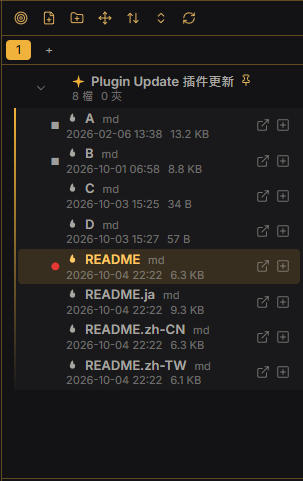
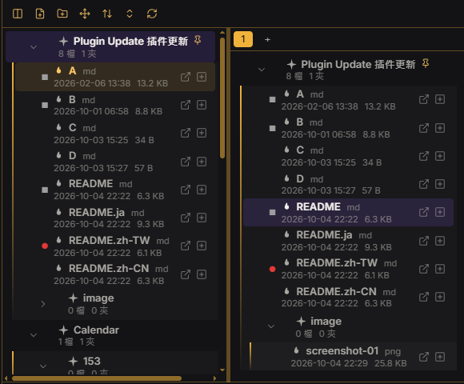

# Focus File Manager

**English** | [繁體中文](README.zh-TW.md) | [簡體中文](README.zh-CN.md) | [日本語](README.ja.md)

A file manager for Obsidian that puts a **file pane** next to a **focus pane**. Focus zones hold shortcuts to the files and folders you are working on right now, so you don't have to dig through the folder tree again and again.

## Features

### Layout and views
- File manager on the left, focus zones on the right. Show either one or both, with a draggable divider (double-click it to reset).
- Open it in the left sidebar or in the main area. Toolbar buttons can be text, icons, or icons with labels, and the view-mode buttons can be merged into one cycling button.
- Two file-manager styles: **Tree** (default, expandable folders) and **Explorer** (computer-style: a path bar with back / forward / up, clickable path segments, right-click to copy the path, mouse back/forward buttons, Alt+←/→, Backspace). Focus zones are not affected.
- Four commands for switching the view (file manager only / focus zone only / both / cycle). They have no default hotkeys; assign your own.

### Focus zones
- Create several named zones (tabs); rename, delete and reorder them.
- Add files and folders by right-click ("Add to focus zone…") or by dragging from the file manager; remove them by right-click or by dragging them back.
- For folders choose "include everything below" or "current level only".
- **Temporary (virtual) folders** group shortcuts inside a zone without creating real folders.

### Selecting, copying and moving
- Ctrl / Shift multi-select, select all (visible or including collapsed folders), copy / cut / paste with shortcuts or the right-click menu, **also across vaults** on desktop, copy relative or full paths.
- A selection mode: right-click → "Enter selection mode" on desktop; **swipe right** on mobile, then tap more items or swipe on a lower item to select the whole range.
- Drag to move. A **cross-level move** switch limits dragging to the same level; while it is off, other levels are dimmed during a drag (on/off and dim level are configurable).
- Double-click (or F2) to rename; the double-click interval is adjustable.

### Batch rename
- Presets for numbering (`{n}`, `{name}`, `{ext}`, `{i}`, start / step / zero padding, e.g. `100 Foo`, `200 Bar`) and for find & replace (regex, case sensitivity). Create as many presets as you like.
- Live preview, and a ✕ on every row to leave an item out of this run. A folder's right-click menu can batch-rename the files inside it.

### Sorting
- Default (Obsidian), manual, name A→Z / Z→A, modified time newest / oldest, created time newest / oldest, with a "folders first" switch.
- Manual order: move up / down, up / down one level, pin to top (with a pin marker), drag to reorder, and reset the manual order (with confirmation).

### Information shown
- Folders: file count (choose which extensions count, optionally recursive) and subfolder count. Files: extension, created time and size.
- Place the information after the name, below it, or split; choose the size format (automatic units or custom unit / decimals / base).
- Hover to see modified and created times; right-click → Properties shows size, times and folder totals.
- Optional full names (with or without wrapping to the sidebar width) and a custom text size (or follow Obsidian).

### Opening files
- Single click opens; or turn that off and use the open icon beside each file instead.
- Open in the current tab or in a new tab (next to the current tab, or at the end).
- Right-click: open, open in a new tab to the right, open to the right (split), open in a new window and show in folder (desktop). Colors and opacity of the open icons are configurable.
- Optionally make clicking a folder select only, so that just the arrow expands or collapses it. "Expand all / Collapse all" can be merged into one cycling button, with an exclusion list (folder names or paths, wildcards allowed).

### Markers
- Open-file markers: one for the file currently shown and one for files open in background tabs; symbol, icon or emoji and color are customizable, each with a reset button.
- Pin markers, and **Obsidian bookmarks sync**: add or remove bookmarks from the menu and see bookmarked items marked.

### Creating files
- New note and new folder (toolbar and right-click), plus Base, Canvas, Excalidraw (if the plugin is enabled) and your own custom file types.

### Appearance and themes
- Uses Obsidian's native style classes, so themes and CSS snippets apply (tested against the Rathgar Gold theme's CSS). The plugin detects whether the theme draws its own icons and arrows and avoids duplicates.
- Replace the expand arrows, folder and file icons (also per extension) with icon names or emoji, using a built-in icon picker with categories, an "All" tab and search.
- Per-item icon, text color, background color and background opacity, with **saved appearance templates**.
- Indent guides: on/off, color, opacity, thickness, line style, indent distance, built-in templates, custom CSS declarations, and import / export to a path of your choice.

### Languages
- English, 繁體中文, 簡體中文 and 日本語 (Japanese and Simplified Chinese are machine translations and may be inaccurate). Follows the system language by default, falls back to English.
- Export the English template as JSON, translate it and import it back. Imported languages are named after the file and can be removed again.

## Install

**Manual:** download `main.js`, `manifest.json` and `styles.css` from the latest [release](../../releases) into `<vault>/.obsidian/plugins/focus-file-manager/`, then enable the plugin.

**BRAT:** add this repository's URL in the BRAT plugin.

Open it from the ribbon icon or from the command palette ("Open Focus File Manager in sidebar / main area").

## Disclosures

- **No network requests, no telemetry, no payment.**
- Files outside the vault are only touched when *you* ask for it: cross-vault copy / cut / paste (uses the system clipboard and a small temp file `obsidian-ffm-clipboard.json` in your OS temp folder), exporting / importing style or language files to an absolute path, and "Show in folder".
- Uses a few undocumented Obsidian internals (the core Bookmarks plugin, the hotkey settings tab). They may change between Obsidian versions.
- Mobile support is experimental: cross-vault features are desktop only and drag and drop does not work on touch screens.

