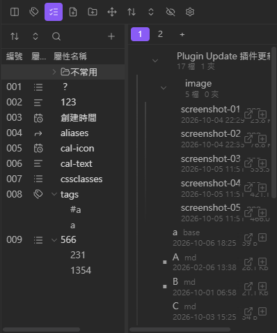
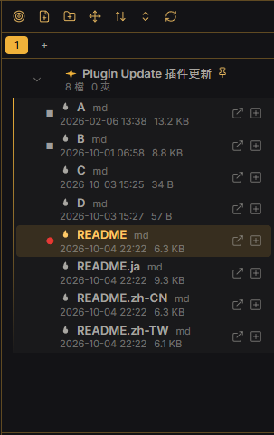
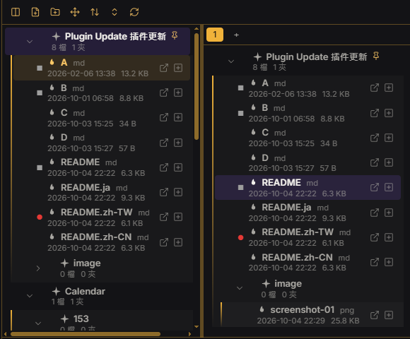
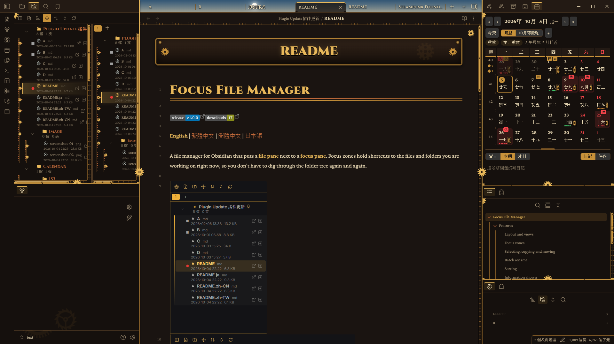
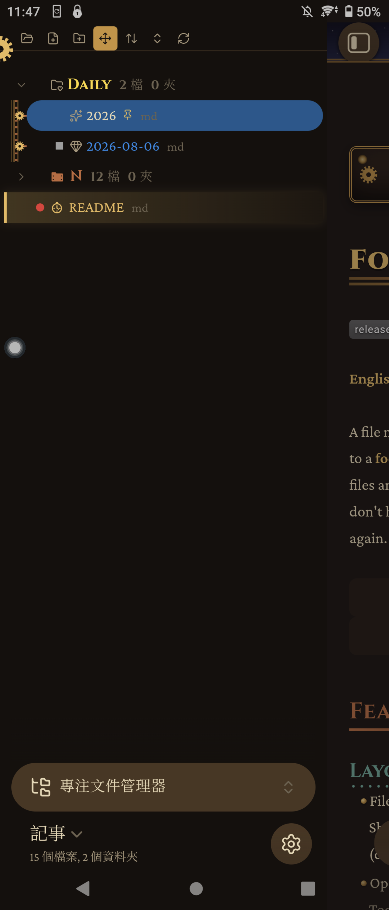
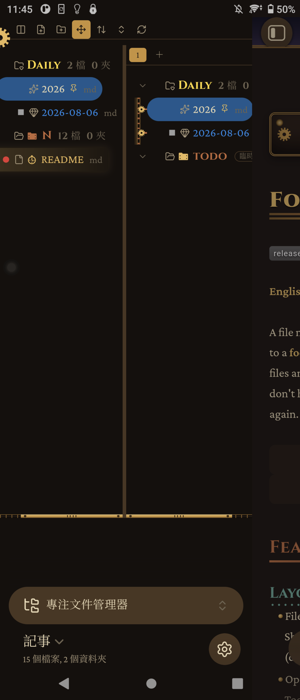

# Focus File Manager

**English** | [繁體中文](README.zh-TW.md) | [簡體中文](README.zh-CN.md) | [日本語](README.ja.md)

A file manager for Obsidian that puts a **file pane** next to a **focus pane**. Focus zones hold shortcuts to the files and folders you are working on right now, so you don't have to dig through the folder tree again and again. Since 2.0.0 the left pane can also switch to a **tag manager** and a **property manager**, so you can tidy up the tags and properties of your whole vault.

  
  

<<<<<<< HEAD

  
  

  
  

=======

  
  

## Changelog

### 2.0.0

This release adds tools for tidying tags and properties, batch operations, and more sorting and menu settings. Details are in "Features" and "How to" below.

**New: tag and property management**
- **Tag manager**: lists every tag in the vault with the columns number, status (lock), tag name, tag note, last used and count. Supports sorting, nested display, search, rename, merge, delete, folders for grouping, removing duplicate tags, and expanding the notes that use a tag.
- **Property manager**: lists every property with a type icon; list-type properties can be expanded to show each value. Supports batch type changes, rename, delete, copy, adding values, creating properties and folders for grouping.
- Switch the left pane with the "Tag manager" and "Property manager" toolbar buttons, or open either one in a **new tab** with the **＋** at the top right of the panel or with a command (the tab version keeps its own column widths and column formats).
- Right-click a column to set **align left / center / right**, a custom shift distance, text wrapping, and a one-time auto-fit of the column widths.

**New: batch operations**
- **Batch edit YAML**: add, edit, delete and sort properties for all or some of the selected files. Supports date and date + time types, a different value for every file, quick-picking values that already exist in the vault, a preview (with a source diff) and saved presets.
- **Batch create**: create many notes, folders, template daily notes, Bases, Canvases and more at once, then go straight into batch rename.
- **Batch rename** gets **list replace**: paste or import a list of names and apply them in order; it can be saved as a preset.
- **Move files by tags** and **Move files by YAML**: filter the selected files with include / exclude conditions, review the result, then move them to a path you choose.
- New right-click **Copy names** (works on several items).

**New: menu, sorting and display**
- **Right-click menu** manager: switch every item on or off, reorder it, change its icon, and add your own separators.
- With manual sorting, right-click a folder (or the empty area for the root) and choose **Sort this folder…**. A new **Folder position** setting puts folders at the top, at the bottom, or mixed with files by name.
- **Hide / exclude files**: hide or unhide by right-click; the eye button on the toolbar shows or hides the excluded items.
- Right-click a tab and choose **Locate in Focus File Manager**; click the file name under the tab bar to locate the file, or double-click it to rename.
- Tags inside notes can be set to **edit on single click and search only on double click**.
- Type `#` in the settings search box to list every section of the settings and jump to it.
- Optionally open the plugin in the left sidebar automatically when it is enabled.
- Every row of the "Properties…" window has a copy button, and the text can be selected and copied.

**Fixes and changes**
- Fixed: the open icon was still forced on after "Show open icon" was turned off.
- Removed the "Refresh" button from the toolbar (open markers now update automatically).

### 1.0.0

First release: file pane and focus zones, batch rename, manual sorting, open markers and bookmark sync, theme compatibility, indent guides, multiple languages.
>>>>>>> dev2

## Features

### Layout and views
- File manager on the left, focus zones on the right. Show either one or both, with a draggable divider (double-click it to reset).
- The left pane can switch between **File manager / Tag manager / Property manager** (toolbar buttons; press the same button again to return to the file manager).
- Open it in the left sidebar or in the main area; it can open in the left sidebar automatically when the plugin is enabled (on by default). Toolbar buttons can be text, icons, or icons with labels, and the view-mode buttons can be merged into one cycling button.
- Two file-manager styles: **Tree** (default, expandable folders) and **Explorer** (computer-style: a path bar with back / forward / up, clickable path segments, right-click to copy the path, mouse back/forward buttons, Alt+←/→, Backspace). Focus zones are not affected.
- The settings page has a search box; type `#` to list every section and jump to it.

### Focus zones
- Create several named zones (tabs); rename, delete and reorder them.
- Add files and folders by right-click ("Add to focus zone…") or by dragging from the file manager; remove them by right-click or by dragging them back.
- For folders choose "include everything below" or "current level only".
- **Temporary (virtual) folders** group shortcuts inside a zone without creating real folders.

### Selecting, copying and moving
- Ctrl / Shift multi-select, select all (visible or including collapsed folders), copy / cut / paste with shortcuts or the right-click menu, **also across vaults** on desktop, copy relative or full paths, or **names** (works on several items, one per line).
- A selection mode: right-click → "Enter selection mode" on desktop; **swipe right** on mobile, then tap more items or swipe on a lower item to select the whole range.
- Drag to move. A **cross-level move** switch limits dragging to the same level; while it is off, other levels are dimmed during a drag (on/off and dim level are configurable).
- Double-click (or F2) to rename; the double-click interval is adjustable.
- **Move files by tags / Move files by YAML**: see "Move files by tags / YAML" below.

### Batch operations
- **Batch rename**:
  - Presets for numbering (`{n}`, `{name}`, `{ext}`, `{i}`, start / step / zero padding, e.g. `100 Foo`, `200 Bar`), find & replace (regex, case sensitivity) and **list replace** (paste or import a list of names, one per line, applied in order; you get a warning when the list and the files differ in number, which you can ignore and continue). Create as many presets as you like.
  - Live preview, and a ✕ on every row to leave an item out of this run; you can also drag rows or use ↑↓ to reorder them. A folder's right-click menu can batch-rename the files inside it.
- **Batch create**: right-click a folder or an empty area → "Batch create…", choose the type (note, folder, template daily note, Base, Canvas, Excalidraw, custom type), the count and the name; afterwards batch rename opens automatically. The limit per run is 10 by default and can be raised in the settings (up to 50).
- **Batch edit YAML**: see "Batch edit YAML" below.

### Tag manager (2.0.0)
- Lists every tag with the columns number, status, tag name, tag note, last used and count. Drag the column borders to resize; text that is too long is cut off with ….
- First-row buttons: sort (tag name A→Z / Z→A, last used newest / oldest, manual order), show nested tags, expand all / collapse all, search (matches tag names and notes), remove duplicate tags, and the **＋** that opens the manager in a tab.
- **Status (lock)**: click the lock to lock a tag (it turns red). A locked tag cannot be renamed, deleted or merged.
- **Tag note**: click the note column to write a description for a tag.
- **Last used**: updated whenever the tag is newly added to a note, shown with `m` / `h` / `d` / `y` (minutes / hours / days / years), e.g. `15 h`, `246 d`, `1 y`. Until a time has been recorded, the latest modified time of the notes using the tag is shown instead.
- Right-click: create tag, search (include / exclude; collect several conditions and run them together), copy tag names / copy tag names with # (works on several), rename (or double-click), enter selection mode, merge tags, delete tags, lock / unlock, create folder and add to / move out of a folder, show the files using the tag, move up / down / up one level / down one level.
- **Folders** only group tags; they do not change the tag hierarchy.
- The **⌄** to the left of a tag name expands the notes that use the tag; click a note to open it.
- **Remove duplicate tags**: finds tags with similar names and groups them. You choose which one to keep, then merge or delete the others; the similarity threshold is adjustable.

### Property manager (2.0.0)
- Lists every property with the columns number, property type (icon), property name and count. The icon follows the type Obsidian has assigned to the property (text, list, number, checkbox, date, date & time, tags, aliases).
- First-row buttons: sort (property name A→Z / Z→A, manual order), expand all / collapse all, search, and the **＋** that opens the manager in a tab.
- List-type properties can be expanded to show every value with its usage count; right-click a value to **rename** or **delete** it (applied to all notes).
- Right-click: property type (batch), rename (batch), delete property (batch), enter selection mode, copy property names / copy property type + name / copy properties (with values), add values (list properties, batch), search, create property, create folder and add to / move out of a folder, move up / down / up one level / down one level.
- The folders created here also become the categories used when picking properties from the vault in "Batch edit YAML".

### Common settings of the manager panels (2.0.0)
- Right-click a column header or a cell in the tag or property manager → "Column format…": align left / center / right, a custom shift distance (px), text wrapping (wrap long names instead of showing …), auto-fit this column / all columns (one time only; widths are not adjusted continuously), and reset this column.
- A panel opened in a **new tab** keeps its own column widths and column formats, so it does not affect the one in the left pane (and vice versa).
- Open them in a tab from the command palette, or switch the left pane with commands (see "Commands" below).

### Move files by tags / YAML (2.0.0)
- Select the files or folders to work on, then right-click → "Move files by tags…" or "Move files by YAML…".
- By tags: click a tag to cycle "include (green) → exclude (red) → unused", and choose whether a file must contain all or any of the selected tags.
- By YAML: add several conditions (all must match). Each condition has "Include / Exclude", a property, and either "Has the property", "Specific values" or, for date and date + time properties, "Date range".
- The matching files are listed (you can untick single files); enter or pick a destination path and move them. A missing destination folder is created, and files whose name already exists there are skipped, not overwritten.

### Sorting
- Default (Obsidian), manual, name A→Z / Z→A, modified time newest / oldest, created time newest / oldest.
- **Folder position**: folders at the top, folders at the bottom, or "mixed by name" – files and folders are sorted together by name, and a folder whose name starts with a file's name (for example `A-image` and `A.md`) goes right before or right after that file (your choice).
- Manual order: move up / down, up / down one level, pin to top (with a pin marker), drag to reorder, and reset the manual order (with confirmation).
- With manual sorting, right-click a folder (or the empty area for the root folder) → "Sort this folder…" to rearrange it by name or time, optionally including all subfolders. The result is written into the manual order, so you can still adjust it by hand afterwards.

### Information shown
- Folders: file count (choose which extensions count, optionally recursive) and subfolder count. Files: extension, created time and size.
- Place the information after the name, below it, or split; choose the size format (automatic units or custom unit / decimals / base).
- Hover to see modified and created times; right-click → "Properties…" shows size, times and folder totals. Every row has a copy button on the right, and the text can be selected and copied.
- Optional full names (with or without wrapping to the sidebar width) and a custom text size (or follow Obsidian).

### Opening files
- Single click opens; or turn that off and use the open icon beside each file instead (whether the icon is shown is entirely controlled by the settings).
- Open in the current tab or in a new tab (next to the current tab, or at the end).
- Right-click: open, open in a new tab to the right, open to the right (split), open in a new window and show in folder (desktop). Colors and opacity of the open icons are configurable.
- Optionally make clicking a folder select only, so that just the arrow expands or collapses it. "Expand all / Collapse all" can be merged into one cycling button, with an exclusion list (folder names or paths, wildcards allowed).
- **Locate from a tab**: right-click a tab → "Locate in Focus File Manager" expands the tree, scrolls to the file and briefly highlights it. You can also click the file name under the tab bar to locate it (it waits for the double-click interval; a double-click starts renaming instead). This can be turned off in the settings.

### Markers
- Open-file markers: one for the file currently shown and one for files open in background tabs; symbol, icon or emoji and color are customizable, each with a reset button.
- Pin markers, and **Obsidian bookmarks sync**: add or remove bookmarks from the menu and see bookmarked items marked.

### Creating files
- New note and new folder (toolbar and right-click), plus Base, Canvas, Excalidraw (if the plugin is enabled) and your own custom file types; new items can be located automatically.
- Template daily note: set the daily note template paths and the file name format, then create one with a right-click.
- Batch create: see "Batch operations" above.

### Hide / exclude files (2.0.0)
- Right-click → "Hide / unhide (exclude)" adds a file or folder to the exclusion list; you can also edit the list in the settings (names, paths and wildcards are supported).
- The eye button on the toolbar shows or hides the excluded items: hidden by default, and excluded items are dimmed when shown.
- Exclusion only affects the file pane, not the focus zones.

### Right-click menu manager (2.0.0)
- Settings → "Right-click menu": switch each item on or off, move it up or down, and change its icon (built-in icon picker). The separators that are in the menu are listed here too: move or remove them, insert one with "Insert a separator below", or add one at the end with "Add separator". Everything is on by default, and one button restores the defaults.
- This manages the right-click menu of files and folders; it does not cover the menus of empty areas or of the tag / property managers.

### Appearance and themes
- Uses Obsidian's native style classes, so themes and CSS snippets apply (tested against the Rathgar Gold theme's CSS). The plugin detects whether the theme draws its own icons and arrows and avoids duplicates.
- Replace the expand arrows, folder and file icons (also per extension) with icon names or emoji, using a built-in icon picker with categories, an "All" tab and search.
- Per-item icon, text color, background color and background opacity, with **saved appearance templates**.
- Indent guides: on/off, color, opacity, thickness, line style, indent distance, built-in templates, custom CSS declarations, and import / export to a path of your choice.

### Languages
- English, 繁體中文, 簡體中文 and 日本語 (Japanese and Simplified Chinese are machine translations and may be inaccurate). Follows the system language by default, falls back to English.
- Export the English template as JSON, translate it and import it back. Imported languages are named after the file and can be removed again.

## How to

### Open the tag manager / property manager
1. On the toolbar, the "Tag manager" and "Property manager" buttons sit to the right of the view buttons such as "File manager". Click one to switch the left pane; click it again to return to the file manager.
2. To keep it in its own tab, click the **＋** at the far right of the panel's first row, or use the command "Open tag manager / property manager in a tab".
3. You can also switch the left pane with the commands "Show tag manager / property manager / file manager in the left area".

### Tidy tags
1. **Rename**: double-click a tag name (or select it and press F2), then press Enter. Renaming a parent tag renames the nested tags below it too (for example `project` → `proj` turns `project/alpha` into `proj/alpha`).
2. **Merge**: select tags → right-click "Merge tags…". In "Resulting tag name", enter an existing tag to merge into it, or a new name to rename and merge. Then choose what happens to the merged tags in your notes: "Replace with the new tag name", "Delete everything" or "Delete only the # (keep the text)".
3. **Delete**: right-click "Delete tags…" and choose "Delete everything" or "Delete only the # (keep the text)".
4. **Search**: right-click "Search (include) / Search (exclude)" jumps to Obsidian's built-in search. To combine several conditions, collect them with "Add search condition (include / exclude)" and press "Run search"; this builds a query such as `tag:#a -tag:#b`.
5. **Copy**: select tags and press `Ctrl+C` to copy the tag names, or `Ctrl+Shift+C` to copy them with a #.
6. **Remove duplicate tags**: press "Remove duplicate tags" in the first row, adjust the similarity threshold, choose the tag to keep in each group, then press "Merge" or "Delete".
7. Locked tags are never changed by the steps above; if a nested tag below a tag is locked, the operation is blocked as well.

### Tidy properties
1. Select properties (`Ctrl` / `Shift` for several, or right-click → "Enter selection mode") → right-click to change the type, rename, delete, copy or add values in batch.
2. Expand a list-type property and right-click a single value to rename or delete it (all notes are updated).
3. "Create property" creates a property in advance with a type of your choice; "Create folder" groups properties so you can filter by folder later in "Batch edit YAML".
4. The type icons follow Obsidian's type settings; when you change a type here, the icon updates immediately.

### Batch edit YAML
1. Select files (or folders) → right-click "Batch edit YAML…".
2. At the top, switch between "Add property / Edit property / Delete property / Sort properties" and choose the scope: all selected files, or only some of them.
3. **Add property**: the property name can be one per line, or written as `name=value` to give the value directly. Choose the value type (Auto-detect, text, list, number, checkbox, date, date & time; the date types have "Today" / "Now" quick fill) and decide whether an existing property is skipped, overwritten or merged into a list.
4. **Value scope**: "Follow the apply scope" asks for the value once; "Enter each value separately" gives every file its own value, either one value per line (in file order) or in a box for each file where you can type or pick a value. Leave one empty to skip that file.
5. Quick-picking existing values is only offered for **list-type and tags** properties: suggestions appear while you type, and you can also click the existing values shown as chips.
6. "Properties used elsewhere in the vault" can be filtered by the folders you made in the property manager, or by "Not in any category" (properties that are not in any folder yet).
7. **Sort properties**: with "Custom order", drag the properties (or press ↑↓) into the order you want.
8. When it is set up, press "Convert". The operation goes into the "Pending operations" queue (edit it with ✎ or remove it with ✕). The right side shows a preview or a source diff, and you can show only the files that change. Nothing is written until you press "Apply".
9. A combination you use often can be saved with "Save as preset" and loaded later; operations that use "Enter each value separately" are not saved in presets.

### Move files by tags / YAML
1. Select the files or folders → right-click "Move files by tags…" or "Move files by YAML…".
2. Set the include / exclude conditions; the matching files are listed right below, and you can untick the ones you don't want to move.
3. Enter or pick the destination path (suggestions appear while you type), then press "Move".

### Customize the right-click menu
1. Settings → "Right-click menu".
2. Every row has: a switch, change icon, insert a separator below, move up / down. The separators currently in the menu each have their own row that you can move or remove; to get a menu without separators, remove them all.
3. "Restore default order and switches" also clears the custom icons and separators.

### Adjust columns
- Right-click the header or a cell in the tag / property manager → "Column format…".
- Drag the border between two column headers to change the width.

## Commands

| Command | Description |
| --- | --- |
| Open Focus File Manager in sidebar | Open it in the sidebar |
| Open Focus File Manager in main area | Open it in the main area |
| Show file manager only / Show focus zone only / Both / Cycle view | Switch the layout (no default hotkeys; assign your own) |
| Show file manager / tag manager / property manager in the left area | Change what the left pane shows |
| Open tag manager / property manager in a tab | Open the manager in a new tab (switches to it if it is already open) |

## Install

**Manual:** download `main.js`, `manifest.json` and `styles.css` from the latest [release](../../releases) into `<vault>/.obsidian/plugins/focus-file-manager/`, then enable the plugin.

**BRAT:** add this repository's URL in the BRAT plugin.

Open it from the ribbon icon or from the command palette ("Open Focus File Manager in sidebar / main area").

## Disclosures

- **No network requests, no telemetry, no payment.**
- Files outside the vault are only touched when *you* ask for it: cross-vault copy / cut / paste (uses the system clipboard and a small temp file `obsidian-ffm-clipboard.json` in your OS temp folder), exporting / importing style or language files to an absolute path, and "Show in folder".
- **Batch operations on tags, properties, YAML and moving files change your notes directly.** Back up your vault first, and check the preview before big changes.
  - Renaming, merging and deleting tags edits the `#tag` text in note bodies and the `tags` in the frontmatter (frontmatter tags are rewritten as a list). A `#text` inside a code block is not a tag and is left alone.
  - Batch edit YAML and renaming / deleting / adding values to properties are written through Obsidian's frontmatter interface, so comments and the original layout inside the YAML may be tidied away.
  - Tag notes, locks, folders and "Last used" are stored only in the plugin settings and are never written into your notes.
- Uses a few undocumented Obsidian internals (the core Bookmarks plugin, the hotkey settings tab, the core Search plugin, the property type settings). They may change between Obsidian versions; if your Obsidian version does not support the property-type features, a message is shown.
- Mobile support is experimental: cross-vault features are desktop only and drag and drop does not work on touch screens.

## Feedback

Found a bug or have a suggestion? Please [open an issue](https://github.com/yuri55448/Focus-File-Manager/issues) in the GitHub project. Including your Obsidian version, the plugin version, your theme and the steps to reproduce (or a screenshot) makes it much easier to help.
