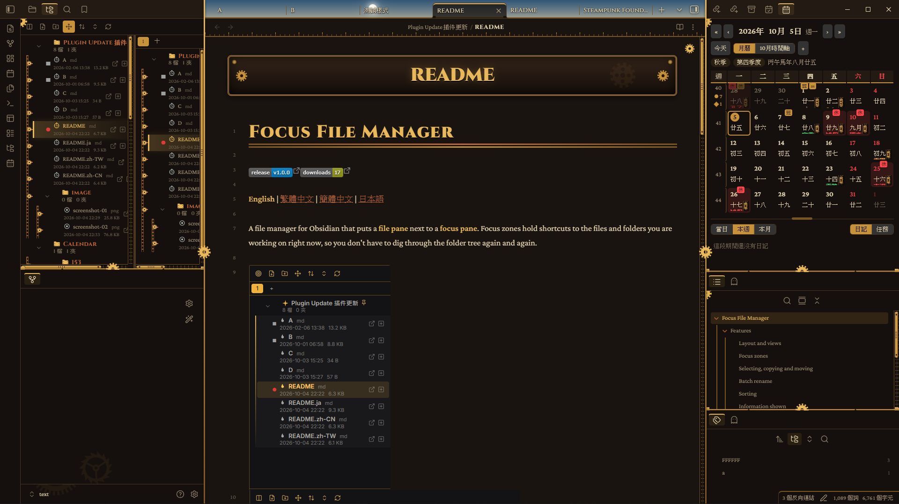
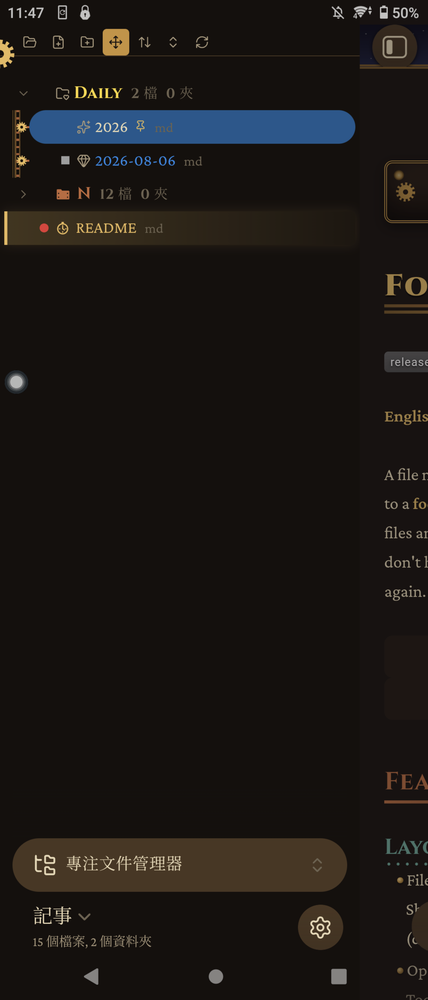
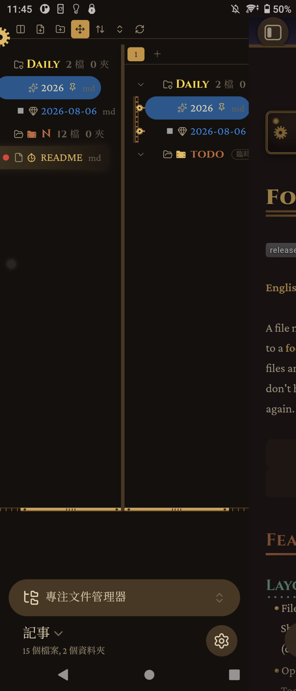

# Focus File Manager

[English](README.md) | **繁體中文** | [簡體中文](README.zh-CN.md) | [日本語](README.ja.md)

Obsidian 檔案管理插件：左邊是**文件管理區**，右邊是**專注區**。專注區用來放現在最需要的文件與文件夾捷徑，不必一直在文件夾樹裡翻找。

## 功能

### 版面與檢視
- 左邊文件管理、右邊專注區，可只顯示其中一個或兩者同時顯示，中間分隔線可拖曳調整（雙擊還原）。
- 可在左側邊欄或主區域開啟。頂部按鈕可選文字、圖示、圖示加文字，「文件管理／專注區／兩者」也能合併成一個循環按鈕。
- 兩種文件管理樣式：**樹狀**（預設，可展開文件夾）與**電腦式**（上方路徑列、上一頁／下一頁／上一層、可點擊的路徑片段、右鍵複製路徑、滑鼠上下頁鍵、Alt+←/→、Backspace）。專注區不受影響。
- 四個切換顯示的指令（只顯示文件管理／只顯示專注區／兩者／循環切換），預設沒有快捷鍵，可自行設定。

### 專注區
- 可建立多個命名的專注區（分頁標籤），能重新命名、刪除、調整順序。
- 用右鍵「加入專注區…」或從文件管理區拖曳加入；右鍵或拖回文件管理區即可移除。
- 文件夾可選「包含所有子層」或「只包含當前層級」。
- **臨時文件夾**：只存在於專注區裡的虛擬文件夾，用來整理捷徑，不會建立真實文件夾。

### 選取、複製與移動
- Ctrl／Shift 多選、全選（可見項目或含未展開）、複製／剪下／貼上（快捷鍵或右鍵），桌面版還能**跨庫**，也可複製相對路徑或完整路徑。
- 選取模式：桌面用右鍵「進入選取狀態」；手機**向右滑**進入，之後可點選更多項目，或對下方項目再向右滑，選取兩者之間全部。
- 拖曳移動。**跨層級移動**開關可把拖曳限制在同一層級；關閉時，拖曳期間其他層級會變灰（開關與變灰程度都可設定）。
- 雙擊（或 F2）重新命名，雙擊判定時間可調整。

### 批量重新命名
- 方案支援編號（`{n}`、`{name}`、`{ext}`、`{i}`，起始數字／遞增／補零，例如 `100 XX`、`200 OO`）與尋找取代（正則、區分大小寫），可自行新增多個方案。
- 即時預覽，每一列右邊有 ✕ 可從這次批量中排除。文件夾右鍵還能批量重新命名它裡面的檔案。

### 排序
- 預設（Obsidian）、手動、名稱 A→Z／Z→A、編輯時間新到舊／舊到新、創建時間新到舊／舊到新，另有「文件夾排前面」開關。
- 手動排序：往上、往下、上一層、下一層、置頂（會顯示置頂符號）、拖曳排序，並可重置手動排序（有確認視窗）。

### 顯示資訊
- 文件夾：檔案數量（可指定計入的副檔名、可遞迴）與子文件夾數量；檔案：副檔名、創建時間、大小。
- 資訊可放在名稱後面、下方，或分開擺放；大小格式可選自動單位或自訂單位／小數位數／進位基數。
- 滑鼠停留顯示最後修改與創建時間；右鍵「屬性」可看大小、時間與文件夾總計。
- 可選顯示完整名稱（是否依側邊欄寬度換行）與自訂文字大小（預設跟隨 Obsidian）。

### 開啟文件
- 單擊開啟；也可關閉，改用檔案旁邊的開啟符號。
- 可在目前分頁或新分頁開啟（目前分頁旁邊，或分頁末尾）。
- 右鍵：開啟、在右側新分頁開啟、在右側開啟（分割）、在新視窗開啟與在資料夾中顯示（桌面版）。開啟符號的顏色與透明度可自訂。
- 可設定單擊文件夾只選取，只有點箭頭才展開／收合。「全部展開／全部收合」可合併成一個循環按鈕，並有排除清單（文件夾名稱或路徑，可用萬用字元）。

### 標記
- 開啟標記：目前顯示中的文件與背景分頁中的文件各一種，符號、圖示或 emoji 與顏色都能自訂，各有重置按鈕。
- 置頂標記，以及與 **Obsidian 書籤連動**：可從選單加入或移除書籤，已加入書籤的項目會有標記。

### 新增檔案
- 新增筆記與文件夾（工具列與右鍵），另有 Base、畫布、Excalidraw（需啟用該插件）與自訂檔案類型。

### 外觀與主題
- 使用 Obsidian 原生的樣式類別，主題與 CSS 片段可直接套用（已對照 Rathgar Gold 主題的 CSS 調整），並會偵測主題是否自己畫了圖示與箭頭，避免重複。
- 展開符號、文件夾與檔案圖示（可依副檔名）都能換成圖示名稱或 emoji，內建圖示選擇器有分類、「全部」與搜尋。
- 每個項目可設圖示、文字顏色、背景顏色與背景透明度，並可**儲存多個外觀模板**。
- 縮排線：開關、顏色、透明度、粗細、線型、縮排距離、內建範本、自訂 CSS 宣告，可導出／導入到指定路徑。

### 語言
- 內建 English、繁體中文、簡體中文、日本語（日文與簡體中文為機器翻譯，可能不準）。預設跟隨系統語言，找不到時用英文。
- 可導出英文範本 JSON，翻譯後再導入；導入的語言以檔名顯示，也能再移除。

## 安裝

**手動：** 從最新的 [release](../../releases) 下載 `main.js`、`manifest.json`、`styles.css`，放進 `<庫>/.obsidian/plugins/focus-file-manager/`，再到設定啟用插件。

**BRAT：** 在 BRAT 插件中加入本倉庫網址。

從側邊的 ribbon 圖示或指令面板（「在側邊欄／主區域開啟專注文件管理器」）開啟。

## 聲明

- **沒有任何網路請求、沒有遙測、不收費。**
- 只有在你主動操作時才會碰到庫以外的檔案：跨庫複製／剪下／貼上（使用系統剪貼簿，以及作業系統暫存資料夾裡的小檔案 `obsidian-ffm-clipboard.json`）、把樣式或語言檔導出／導入到絕對路徑，以及「在資料夾中顯示」。
- 用到少數 Obsidian 未公開的內部介面（核心書籤外掛、快捷鍵設定頁），可能隨 Obsidian 版本變動。
- 手機版仍屬實驗性質：跨庫功能只有桌面版，觸控螢幕不支援拖曳。

